Table of Contents 
=================

[1.Abstract 3](#abstract)

[2.Introduction 3](#introduction)

[2.1.Problem Type, Statement and Goals
3](#problem-type-statement-and-goals)

[2.2.Literature Review 4](#literature-review)

[2.3.Overview of My Approach 4](#overview-of-my-approach)

[3.Implementation 4](#implementation)

[3.1.Data Set 5](#data-set)

[3.2.Preprocessing, Feature Extraction, Dimensionality Adjustment
6](#preprocessing-feature-extraction-dimensionality-adjustment)

[3.3.Dataset Methodology 10](#dataset-methodology)

[3.4.Training Process 10](#training-process)

[4.Final Results and Interpretation
11](#final-results-and-interpretation)

[4.1.K-Means Clustering 11](#k-means-clustering)

[4.2.Gaussian Mixture Model 13](#gaussian-mixture-model)

[4.3.Agglomerative Hierarchical Clustering
18](#agglomerative-hierarchical-clustering)

[4.3.1.Single linkage 18](#single-linkage)

[4.3.2.Average Distance Linkage 19](#average-distance-linkage)

[4.3.3.Complete linkage algorithm (Farthest point)
20](#complete-linkage-algorithm-farthest-point)

[4.3.4.Ward Linkage Algorithm (Minimum Variance Method)
22](#ward-linkage-algorithm-minimum-variance-method)

[4.4.Hierarchical Density Estimate 23](#hierarchical-density-estimate)

[5.Summary and conclusions 26](#summary-and-conclusions)

[6.References 27](#references)

Abstract
========

This is a Machine Leaning Clustering model analysis for costumer. This
Project focuses on first, preprocessing and analyzing raw data. After
multiple data Visualization, Probabilistic and Statistical analysis of
the data for various clustering algorithms, models were created for this
data and were fitted. To compare each algorithm with the other,
variables like taking the noise in data analysis and number of data
points clustered were accounted for. It is shown in this project whilst
a K-Means is considered as one of the most popular clustering
algorithms, it can be very sensitive to the data noise and it is more if
a partitioning algorithm rather than a clustering algorithm. Moreover, a
new clustering algorithm called Density Based Clustering based on
Hierarchical Density Estimate (HDBSCAN). HDBSCAN has the advantage of
correctly clustering high dimensional data fast and it also ignores the
data points considered noise.

2.  Introduction
    ============

    1.  Problem Type, Statement and Goals
        ---------------------------------

This problem contains many difficult aspects including:

1.  Categorical features:

> Data contains categorical features; the categorical features should be
> ignored to apply clustering algorithms.

2.  The Data is skewed, imbalanced and sparse:

> Given the variation in each person's information on their bank
> account. The diagrams will show this later in following sections.

3.  The choice of accuracy score is very important:

> Since we are using unsupervised learning methods it is important
>
> what method to use in order to validate the accuracy of the clustering
> method.

4.  High dimensionality of the data:

    The data has 26 features. The Vapnik-Chervonencis (VC) dimension has
    to be explored.

    2.  Literature Review 
        ------------------

> There are multiple existing projects and analysis on clustering.
> Various research papers were analyzed.\[1\]\[2\]

3.  Overview of My Approach
    -----------------------

    First, I started by analyzing the features of the data. I removed
    the categorical features like housing type, number of children etc.
    Then I started the feature engineering process. I removed the highly
    correlated features and summed the assets together and made a
    feature called 'total assets' and did the same for monthly income
    and total debt and created new features.

    After feature engineering and feature reduction, I normalized and
    scaled the data using box cox method \[2\].

    Then I applied some clustering algorithms to find the best one for
    the data. I then compared the clusters using the in-built parameters
    of each data. I used both the probabilistic and visual approach to
    verify each method.

Implementation
==============

> In this section I will show the diagram of the approach and also
> discuss how each algorithm works. The diagram shows each step taken in
> orderly fashion to prepare data for clustering and eventually
> comparison.
>
> 
>
> Figure 1. The Flowchart for Clustering the Data

Data Set
--------

> The Data Set has 47390 entries and 26 features. The table below
> explains some information about the data after the feature engineering
> is done and categorical data removed:

  ------------------------ ----------- ----------------------------
  Feature Name             Data Type   Range or Cardinality
  MonthlyNetIncomeAmount   Numerical   1.000000e+00 -1.408000e+07
  totaldebt                Numerical   0 - 7.605000e+07
  totalassets              Numerical   0- 1.076267e+09
  ------------------------ ----------- ----------------------------

> Added Feature table:
>
> The following is the scaled and normalized features added to the data
> set.

  -------------------------------- ----------- ----------------------
  Feature Name                     Data Type   Range or Cardinality
  MonthlyNetIncomeAmount\_boxcox   Numerical   0-1
  Totaldebt\_boxcox                Numerical   0 - 1
  Totalassets\_boxcox              Numerical   0- 1
  -------------------------------- ----------- ----------------------

An overview of statistics for the engineered data:

5.  Preprocessing, Feature Extraction, Dimensionality Adjustment
    ------------------------------------------------------------

    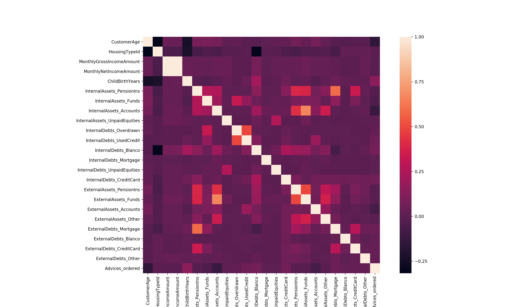

    Figure 2. Correlation Plot for useful features.

Ignoring the categorical features because we are conducting a clustering
algorithm, we can conclude from the diagram that we can eventually sum
assets together and debts together to further reduce the dimensionality
of the data and making it more suitable for accurate clustering
algorithm.

#### Feature Selection and data Selection:

Eventually by summing all the assets we will have new feature called
totalassets and by summing all debts we have a new feature called
totaldebt which both have 47390 entries. We will keep the
MonthlyNetIncome unchanged since it is already the income where taxes
and expenses have been subtracted from.

#### Handling the imbalance and skewed data type

As mentioned in the previous section it is calculated using python that
the skewness rate of the data is 133,47 and 19 for the 3 features. This
shows that our classifier would have a very hard time to cluster the
data. The closer the skewness to zero the more symmetric the
distribution of the data is. The skewness is measured by the third
moment of the standardized moment.

The skewness equation is as the following:

{}

To normalize the distribution of this data **Box Cox\[3\]** can be used
which is a similar method to **Box Mueller** method for generation of
random normal numbers. The box cox method is an optimizer method for
**Differencing** method to generate a new data in the Normal
distribution form for easier data processing as following:

If Y~i~ = Z~i~ -- Z~i~ -- 1 is a transformation to generate a new point
for an unknown set of data there's a lambda optimizer that can find the
best value:

While this formula only works for the positive values Box proposed this
formula to be able to handle negative valued data:

Moreover, we need to scale the data to achieve mean zero and variance 1
for the distribution so we would have a standardized scaled model of the
data.

The following Diagram is the distribution plot before applying
standardization and box cox method.

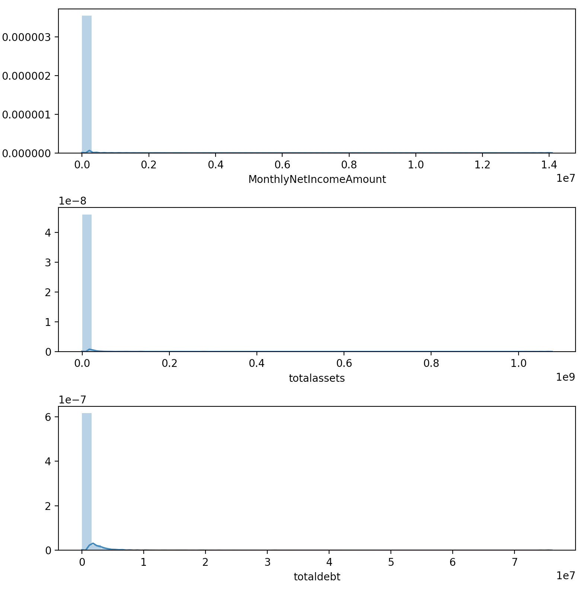

Figure 3. Histogram of Raw data

And the following is after applying normalization and scaling the data:

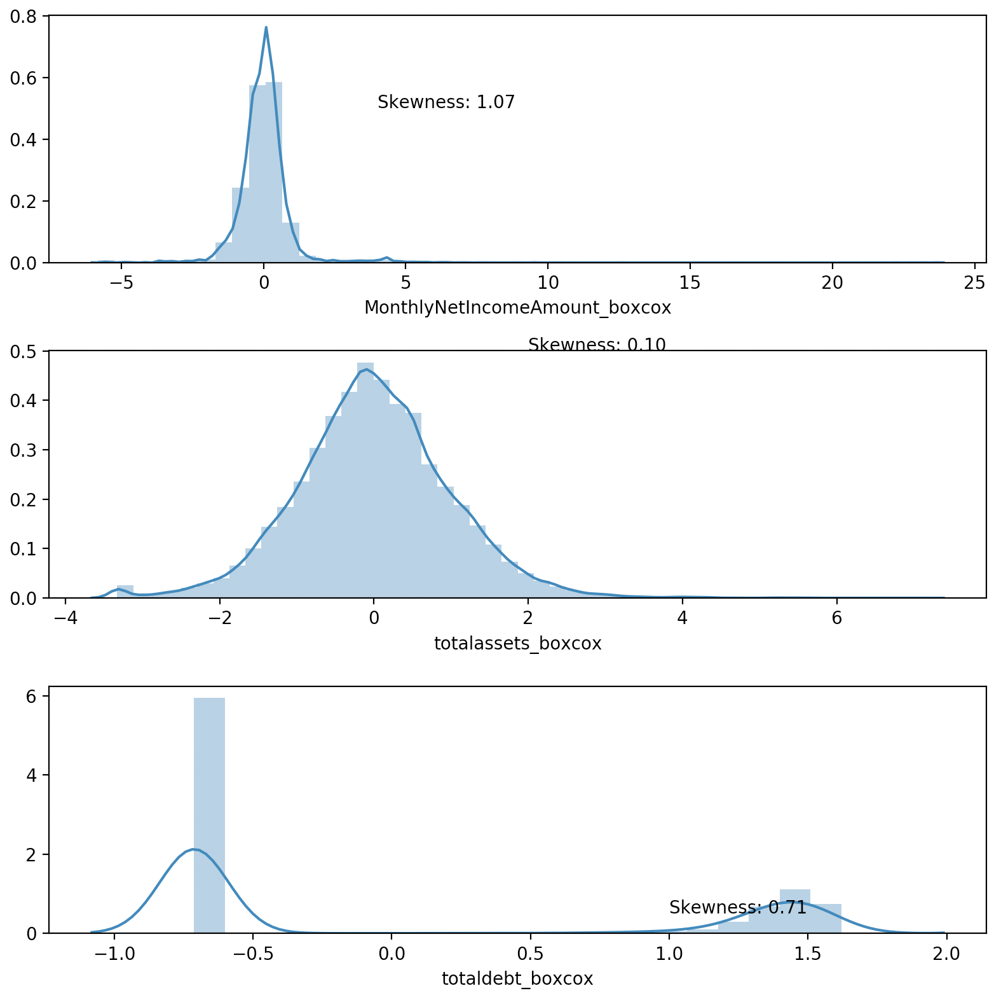

#### 

Figure 4. Histogram of Normalized and scaled data

As can be seen in the both diagrams the scaled and normalized data has
far

less skewness than the raw data.

#### Addition of features and imputation:

The added features are mentioned in the previous section. Also,
imputation is not needed since we do not have any missing data.

.

Dataset Methodology
-------------------

For K-Means Clustering and Gaussian Mixture model and Agglomerative
clustering the convergence of number clusters have to be investigated
using the inertia of the number of clusters. For the Hierarchical
Density Estimate the methodology is different since it is a density
method. The probability of data point placed inside the cluster is
measured and then by Kullback-Leibler (KL) divergence plot (Information
Theory plot) we decide the optimal number of plots. The plots are later
shown ion the results section. The Following Equations Will help us
better understand KL and Cross Entropy (CE):

Training Process
----------------

> After Normalizing the data and finding the desired number of the
> clusters, clustering algorithms were applied, and the plots were made
> to further analyze the data.

#### Model validation and error estimation and Comparison of Results

The validation of any clustering method is very challenging. There are
few methods we have to account for during the validation of the
clustering algorithm.

First, we need to know the computation speed of our clustering
algorithm.

Then, we need to make sure the clustered data did not include any noise
or did not simply partition the data. As mentioned before, majority of
clustering algorithms would merely partition the data which is not very
accurate.

4.  Final Results and Interpretation
    ================================

    8.  K-Means Clustering
        ------------------

The first model I have used here is **K-means** Clustering. The K-Means
clustering method is fairly easy to implement. The algorithm (originally
a signal processing algorithm) aims to cluster data into sets to reduce
the mean square sum of the clusters. In the algorithm:

1.  Assign the cluster to the one that has the smallest mean squred
    Euclidian distance (l2 norm):

> 

2.  Update each cluster by finding the new mean.

> 

After these steps we need a way to find the best number of clusters for
K-Means clustering. Many people suggest using the elbow method in the
inertia plot to find the best score for the number of clusters. This is
not an easy method however widely used.

The following plot shows the inertia of the K-Means clustering.

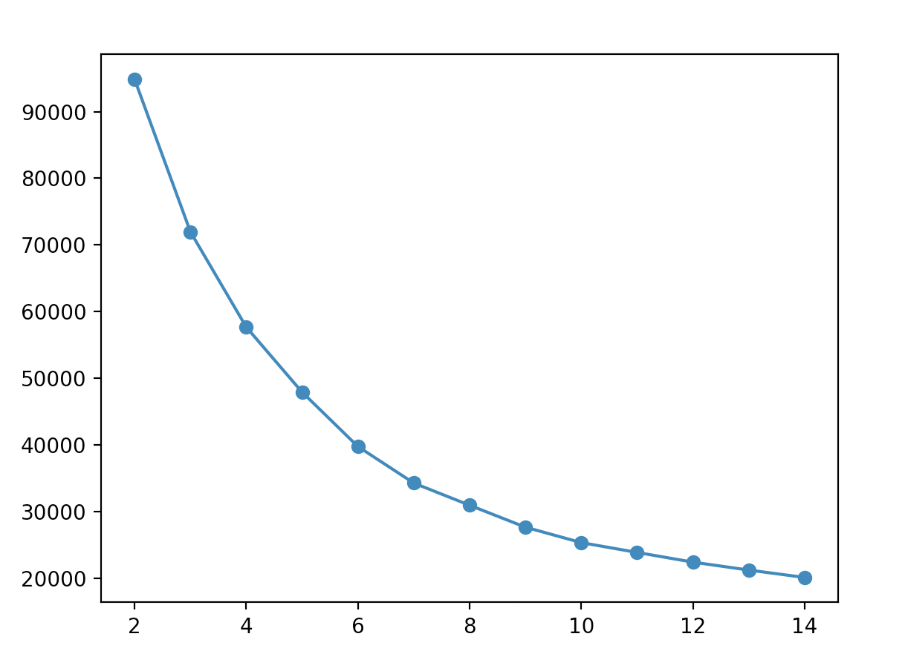{}

Figure 5. The Inertia plot for K-Means Clustering

As can be seen on the plot the elbow occurs between 3-4 clusters and I

decided to pick 4 clusters as the optimal number of clusters. The
following

plot shows the result of clustering:

As can be seen both of

Figure 6. K-Means Clusters with their respected features.

The figure shows all data points being successfully partitioned. The
Clustering is done by creating circular distance measures (l2) norm the
following diagram shows those circles with the data.

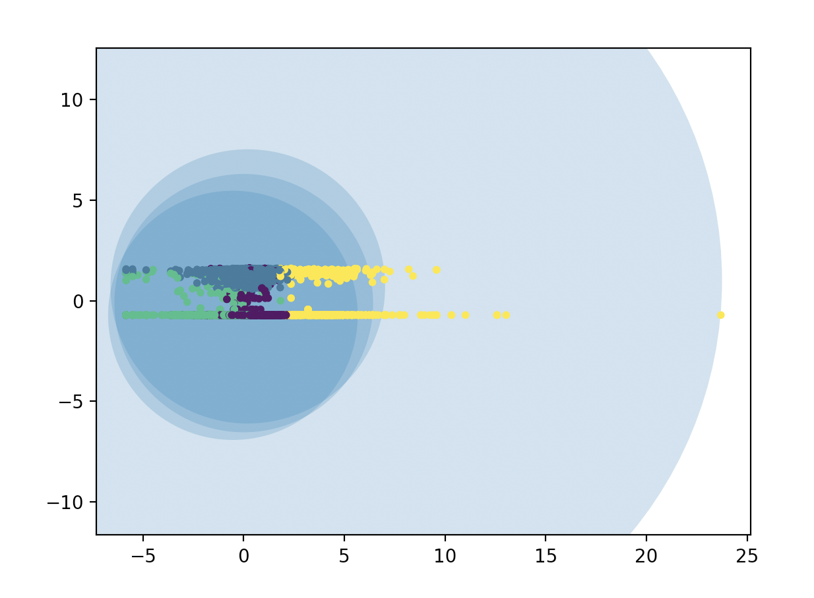

Figure 7. K-Means Clusters with 4 cluster boundaries (circles).

Gaussian Mixture Model
----------------------

The Second model I investigated was **Gaussian mixture models** (GMM).
Gaussian mixture models are often intended for statistical method but
with the use Expectation maximization (EM) method the clusters are
identified.

A Gaussian Mixture model is often consisting of ellipsoidal shapes and
also the distribution has multiple bumps:

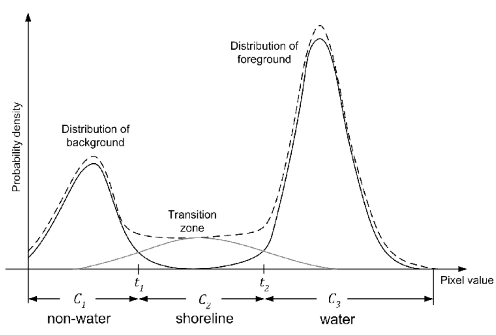

Figure 8. Gaussian Mixture Model Example.

Observing *totaldebt\_boxcox* feature distribution we can see that it is
a gaussian mixture model.

How to estimate which cluster a data point belongs to? **EM algorithm**

EM algorithm has two steps:

E: Compute the best estimate the density of the data point

M: Estimate the next parameter using maximum likelihood estimate (MLE).

Halt when posterior (*F*) converges.

The following shows the result of GMM with EM applied.

Figure 9. The Clusters on Gaussian Mixture Model.

To further analyze the data set under GMM I also plotted the ellipsoids
of the contour plot.

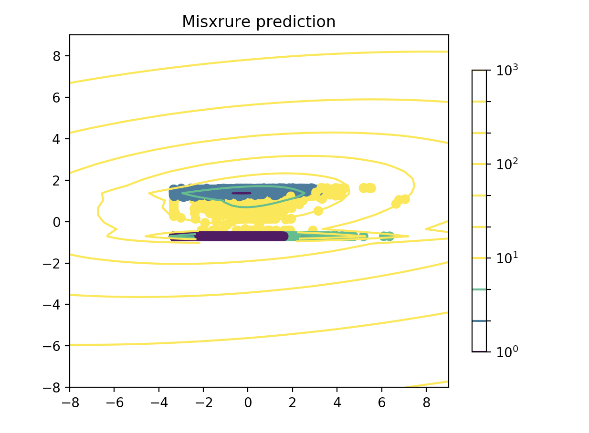

Figure 10. The Contour on Gaussian Mixture Model.

The contours show the 4 clusters found in clustering this data set. This
method again will count the noise of the dataset in the clusters.

Agglomerative Hierarchical Clustering 
--------------------------------------

Agglomerative is another often used method for unsupervised learning
that clusters the data using various dissimilarity measures. A general
algorithm for this method is as following:

1.  Choose number of clusters K

2.  Find the most similar cluster

3.  See if the halting condition is met

4.  If not merge clusters and set K =\> K-1

5.  See if halting condition is true

6.  If not go back to 2

There are various similarity methods and linkage algorithms used in this
method including Nearest Neighbor, Farthest Neighbor with single
linkage, ward linkage etc.

Linkage and similarity method used in this algorithm is highly dependent
on the shape of the data (spiral data, elongated data or congested
clusters of of data). This algorithm can be optimized and be fast, but I
ran the slow model on python and results on our data is as following.

### Single linkage

This algorithm just used Euclidian distance as similarity measure on
nearest neighbor.

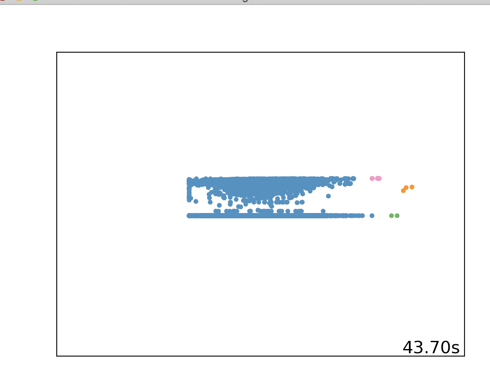{}

Figure 11. Agglomerative clustering with single linkage with the time it
took to run on bottom right.

This algorithm performs poorly since it only clusters very closely
packed data into one cluster.

### Average Distance Linkage

In average distance, the average of the sum of Euclidian distance
between groups of data is measured:

{}

The resulting plot of the clustering algorithm is as following:

{}

Figure 12. Agglomerative clustering with average distance linkage with
the time it took to run on bottom right

### Complete linkage algorithm (Farthest point)

This algorithm uses the maximum distance between two points in clusters:

{}

The resulting plot for clustering with this algorithm is as following.
This algorithm is particularly good for chunks of data.

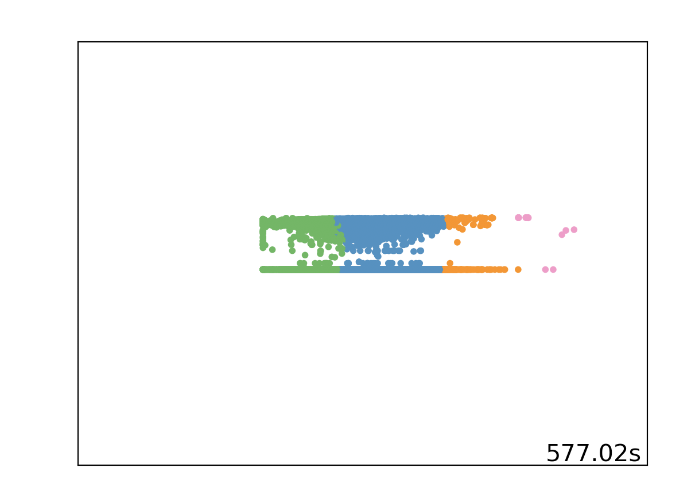{}

Figure 13. Agglomerative clustering with Complete distance linkage with
the time it took to run on bottom right

### Ward Linkage Algorithm (Minimum Variance Method)

This dissimilarity measure will minimize the variance between two
clusters of data.

{}

The resulting clustering diagram is as following:

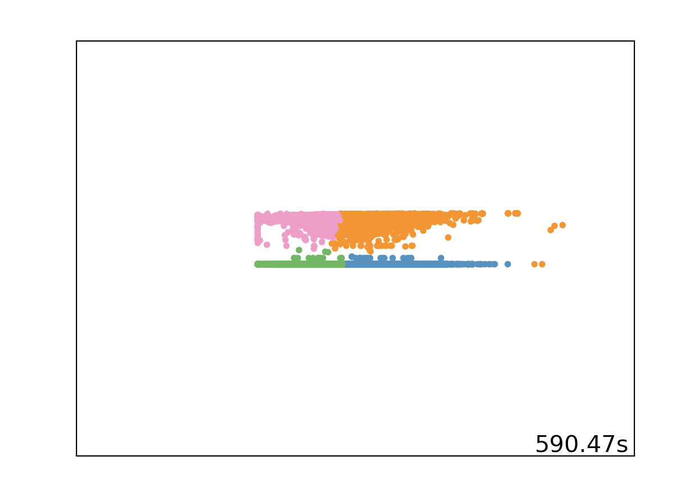{}

Figure 13. Agglomerative clustering with Complete distance linkage with
the time it took to run on bottom right

Hierarchical Density Estimate 
------------------------------

This is an advanced method \[1\] implemented to avoid counting the noise
of the data in the clusters. In other words, HDBSCAN follows the same
methods as Hierarchical clustering except:

-   It has less parameters (only min\_cluster\_size)

-   It doesn't require specific cluster number

-   It doesn't have the parameter epsilon of data elimination like
    DBSCAN

-   Avoids noise in the data

HDBSCAN algorithm:

1.  Find the most dance area of data using core distance.

> 

2.  Keep building dance clusters to min cluster size.

3.  Find the respective core distance using nearest neighbor algorithm.

4.  Create the minimum spanning tree of clusters.

5.  Condense the cluster tree by pruning it.

6.  Extract the clusters:

This is a stable clustering algorithm.

To find the best parameter (min\_cluster\_size) I used the KL divergence
theorem in information theory. Each point has a probability of not being
in a cluster in HDBSCAN with that we can construct the graph of
optimized min cluster size and pick a point where the probability
converges:

Figure 14. The sum score vs min cluster size of HDBSCAN.

As can be seen, p(0.05) is where the min cluster size converges and this
is the point we want.

With the resulting parameter we create 4 clusters with the following
diagram:

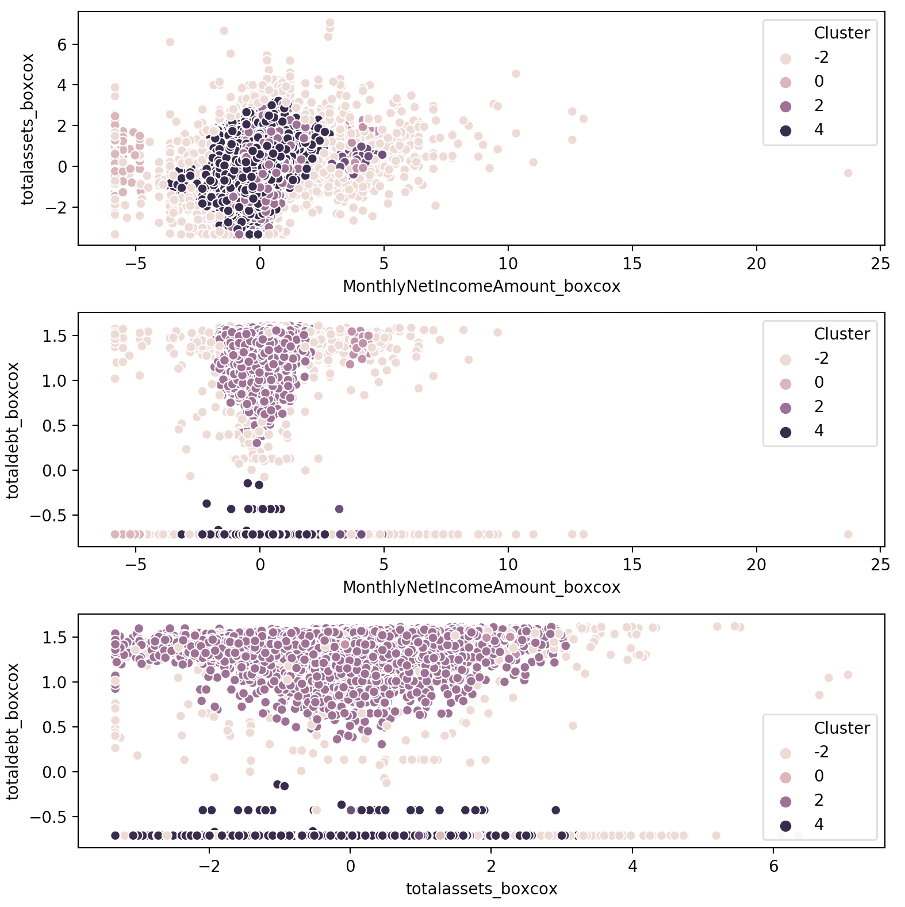

Figure 15. The resulting clusters for HDBSCAN.

Summary and conclusions
=======================

As shown in the results section, the best algorithm to cluster the was
HDBSCAN algorithm. As a very advanced and fast algorithm it can be used
to assign segments for each costumer at the bank. I rank all the
algorithms with the ability to successfully cluster the data as
following:

1.  HDBSCAN

2.  GMM

3.  K-MEANS

4.  Agglomerative (Complete Linkage)

5.  Agglomerative (Ward Linkage)

6.  Agglomerative (Average Linkage)

7.  Agglomerative (Single Linkage)

References 
===========

Cite the sources of your information that came from elsewhere. This
includes other related works you compare with (if any), and sources of
descriptions of systems or methods that you included in your report.

  ------- ------------------------------------------------------------------------------------------------------------------------------------------------------------------------------------------------------------------------------------------------------------------------------------------------------------------
  \[1\]   Campello R.J.G.B., Moulavi D., Sander J. (2013) Density-Based Clustering Based on Hierarchical Density Estimates. In: Pei J., Tseng V.S., Cao L., Motoda H., Xu G. (eds) Advances in Knowledge Discovery and Data Mining. PAKDD 2013. Lecture Notes in Computer Science, vol 7819. Springer, Berlin, Heidelberg.
  \[2\]   Box, G. E. P. and Cox, D. R. (1964). An analysis of transformations, Journal of the Royal Statistical Society, Series B, 26, 211-252.
  \[3\]   Hdbscan, [[https://hdbscan.readthedocs.io/en/latest/comparing\_clustering\_algorithms.html]{.underline}](https://hdbscan.readthedocs.io/en/latest/comparing_clustering_algorithms.html), Accessed Jan 2020.
  ------- ------------------------------------------------------------------------------------------------------------------------------------------------------------------------------------------------------------------------------------------------------------------------------------------------------------------
